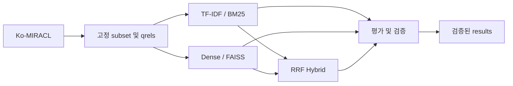

# Hybrid Document Search

## 프로젝트 소개

Sparse, Dense, Hybrid 문서 검색을 동일한 한국어 corpus와 질의로 비교하는 3인 NLP 프로젝트입니다.
검색기와 평가 CLI를 제공하며, FastAPI는 `/health`, Streamlit은 placeholder 상태입니다.
검색 API/UI 연결은 후속 작업입니다.

## 핵심 특징

- TF-IDF, BM25, Sentence Transformer + CPU FAISS, BM25 + Dense RRF 비교.
- Ko-MIRACL 고정 revision의 10k subset과 원본 passage ID 유지.
- 모델 후보·revision·기본 모델은 [dense_models.toml](config/dense_models.toml)에서 관리합니다. 기본값은 `bge` (`BAAI/bge-m3`)이며 `config_default` 정책으로 기록합니다.
- 한 명령으로 원본 다운로드부터 Train/Dev 평가·검증·결과 패키징까지 실행하고 실패 단계부터 재개합니다.
- JSON에 질의별 검색 결과·latency 샘플·코드/데이터/모델 출처를 보존합니다.

## 아키텍처

| 구성 | 역할 |
| --- | --- |
| `data/`, `scripts/prepare_dataset.py` | 원본 다운로드, 고정 subset과 manifest 생성 |
| `retrievers/` | 공통 `search(query, top_k)` 계약, TF-IDF·BM25·Dense |
| `indexing/`, `fusion/` | FAISS 저장·복원, RRF 결합 |
| `evaluation/`, `scripts/evaluate.py` | 품질·query latency 측정 및 검증 |
| `scripts/run_experiment.py` | 순차 worker 실행, checkpoint, 결과 승격 |
| `app/`, `frontend/` | 서비스·UI 진입점 |



## 전체 실험 실행

Python 3.12, uv, WSL2 + RTX 4060의 CUDA 환경에서 저장소 루트에서 실행합니다.
측정 코드 변경은 먼저 로컬 커밋으로 고정합니다.

```bash
uv run --locked --extra sparse --extra dense python -m scripts.run_experiment
# 원본 데이터부터 새로 다운로드하고 세 인덱스와 모든 평가를 재생성
uv run --locked --extra sparse --extra dense python -m scripts.run_experiment --fresh
```

기본 명령은 checksum·조건이 일치하는 완료 단계를 재사용합니다. 전체 완료 후에는 파일과
checkpoint를 검증하고 종료합니다. `--fresh` 전 기존 `results/` 변경은 Git에 보존해야 합니다.
실험 작업 공간은 `artifacts/ko-miracl-full/`이며 다른 인덱스와 전역 모델 캐시는 삭제하지 않습니다.
최종 구조와 재개 규칙은 [평가 문서](docs/EVALUATION.md)를 참조하세요.

## 새 Dev 결과

| 모델 / 방식 | Recall@5 | Recall@10 | MRR@10 | nDCG@10 | Mean ms | P95 ms |
| --- | ---: | ---: | ---: | ---: | ---: | ---: |
| TF-IDF | 0.576667 | 0.722667 | 0.495238 | 0.525324 | 17.720120 | 28.155618 |
| BM25 | 0.587667 | 0.750667 | 0.597913 | 0.593881 | 1.704552 | 2.129968 |
| Dense (BGE-M3) | 0.813667 | 0.958333 | 0.861024 | 0.854857 | 21.594187 | 30.962093 |
| Hybrid (BM25 + BGE-M3) | 0.765333 | 0.927667 | 0.790571 | 0.784433 | 23.784875 | 33.535504 |

2026-10-08 기본 모델을 BGE-M3로 변경하고, 기존 데이터와 BGE 인덱스로 네 방식을 다시 측정했습니다.
3모델 Train/Dev 비교와 인덱스 구축 기록은 기존 측정값을 유지합니다.

Ko-MIRACL 10,000 passages, Train 100 / Dev 50 queries, seed 42. Python 3.12.3 / WSL2 / NVIDIA RTX 4060, embedding `cuda:0`, CPU FAISS. FP32, L2 정규화, batch size 1, Top-K 10, 전체 질의 warm-up 1회, 측정 5회. PyTorch intra/inter-op·FAISS·OMP/MKL/OpenBLAS 2 threads, tokenizer 병렬화 비활성화, TF32 비활성화.

고정된 기존 데이터와 Dev를 다시 사용하는 재현성·결과 정리 실험이다. 새로운 독립 테스트나 전체 MIRACL 공식 벤치마크 성능을 뜻하지 않는다. 단일 GPU 환경의 순차 실행이며 동시 요청 처리량·API 응답 시간은 측정하지 않았다. latency는 실행 당시 시스템 부하에 영향을 받는다.

전체 Dense Train/Dev 비교는 [Dense 문서](docs/DENSE_RETRIEVAL.md), 네 방식 비교와 사례는
[Benchmark 문서](docs/BENCHMARK_RESULTS.md), 해시와 실행 출처는 [experiment.json](results/experiment.json)에 있습니다.

## 개발과 개별 실행

```bash
uv sync --locked --extra sparse --extra dense
uv run --locked --extra sparse --extra dense pytest
uv run --locked --extra sparse --extra dense ruff check .
uv run --locked --extra sparse --extra dense ruff format --check .
uv run uvicorn app.api:app --reload
uv run streamlit run frontend/app.py
```

기본 의존성 CI와 별개로 Sparse/Dense extras를 포함해 테스트합니다. 다운로드 없이 Dense만 확인하려면
`HF_HUB_OFFLINE=1 TRANSFORMERS_OFFLINE=1 uv run --locked --extra dense pytest tests/dense`를 실행합니다.

개별 사용법: [데이터 준비](docs/DATA_PREPARATION.md) · [TF-IDF](docs/SPARSE_MVP.md) ·
[BM25](docs/BM25_RETRIEVAL.md) · [Dense](docs/DENSE_RETRIEVAL.md) · [Hybrid](docs/HYBRID_RETRIEVAL.md).
공통 문서·검색 계약은 [스키마](docs/SCHEMAS.md), 협업 규칙은 [CONTRIBUTING.md](CONTRIBUTING.md)에 있습니다.

## 담당 영역

| 역할 | 작업 영역 |
| --- | --- |
| Sparse / Evaluation | `data/`, TF-IDF·BM25, 평가 |
| Dense Retrieval | 모델·임베딩·FAISS·Dense CLI |
| Integration / Service | 공통 계약·RRF·API·UI |

모델 가중치·원본 데이터·인덱스·로그는 Git에서 제외합니다. `results/`에는 검증된 결과만 저장합니다.
